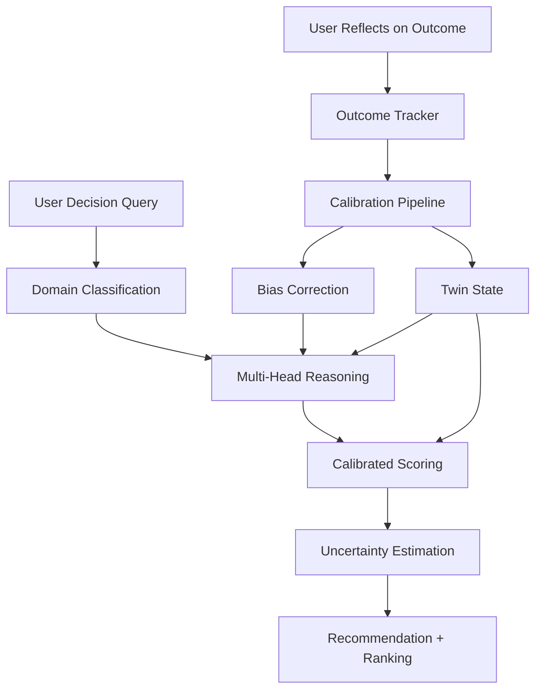

# twin-runtime

**Your AI remembers. But does it judge like you?**

Most AI memory systems optimize recall. twin-runtime optimizes *calibrated judgment*.

twin-runtime is a **calibration-first judgment twin** that learns your decision-making patterns across work domains and provides recommendations that match how you actually choose.

> Memory is input. Calibrated judgment is output.

**Evidence:** 0.758 choice fidelity across 20 real work-domain decisions (alpha).

> **v0.1.0 is an alpha release focused on work-domain calibrated judgment.**
> Best results today: work-domain decisions. Other domains are early/experimental.

---

## Quick Start

```bash
pip install twin-runtime
twin-runtime init
twin-runtime run "Should I prioritize the refactor or the new feature?" \
  -o "Refactor first" "New feature first" "Split the sprint"
```

See [docs/quickstart.md](docs/quickstart.md) for detailed installation and setup.

## Claude Code Integration

### Skills

```bash
# Project-level (recommended)
twin-runtime install-skills

# Personal (all projects)
twin-runtime install-skills --personal
```

Then use `/twin-decide`, `/twin-reflect`, `/twin-status`, `/twin-calibrate`, `/twin-dashboard` in Claude Code.

### MCP Server

```bash
claude mcp add --transport stdio twin-runtime -- twin-runtime mcp-serve
```

Or add to `.mcp.json`:

```json
{
  "mcpServers": {
    "twin-runtime": {
      "command": "twin-runtime",
      "args": ["mcp-serve"]
    }
  }
}
```

The MCP server exposes 5 tools:

| Tool | Description |
|------|-------------|
| `twin_decide` | Run calibrated judgment on a decision |
| `twin_reflect` | Record what you actually chose |
| `twin_status` | Show twin state and reliability |
| `twin_calibrate` | Run batch fidelity evaluation |
| `twin_history` | List recent decision traces |

## What Makes This Different

Most memory systems optimize recall. twin-runtime optimizes calibrated judgment.

| Feature | Memory Plugins | twin-runtime |
|---------|---------------|--------------|
| Core loop | Store and retrieve | Decide, reflect, calibrate |
| Output | "Here's what you said before" | "Here's what you'd likely choose, with uncertainty" |
| Feedback | None | Ground-truth outcome tracking |
| Metrics | Recall accuracy | Choice fidelity, calibration quality |
| Adaptation | Append-only | Bias correction from real outcomes |

## Architecture



**Pipeline flow:**
1. **Domain classification** routes the query to relevant domain heads (work, life_planning, money, etc.)
2. **Multi-head reasoning** activates domain-specific judgment patterns from the twin state
3. **Calibrated scoring** ranks options with per-domain reliability weights
4. **Uncertainty estimation** reports confidence honestly -- low-reliability domains get high uncertainty
5. **Reflection loop** records what you actually chose, feeding the calibration flywheel

## Fidelity Metrics

| Metric | Description | Current Value |
|--------|-------------|---------------|
| **Choice Fidelity (CF)** | % of decisions ranked correctly at #1 | 0.758 |
| **Calibration Quality (CQ)** | Match between stated uncertainty and accuracy | 0.807 |
| **Abstention Correctness** | % of out-of-scope queries correctly refused | ≥0.9 (target) |
| **Temporal Stability (TS)** | Consistency over time | experimental -- insufficient history |
| **Reasoning Fidelity (RF)** | Similarity of reasoning to user's own | v0.2 |

Generate the fidelity dashboard:

```bash
twin-runtime dashboard --output fidelity_report.html --open
```

See [docs/fidelity_report_demo.html](docs/fidelity_report_demo.html) for a sample dashboard.

## CLI Commands

| Command | Description |
|---------|-------------|
| `twin-runtime init` | Initialize twin state |
| `twin-runtime run` | Run a decision through the twin |
| `twin-runtime reflect` | Record what you actually chose |
| `twin-runtime status` | Show twin state and fidelity summary |
| `twin-runtime evaluate` | Run batch fidelity evaluation |
| `twin-runtime dashboard` | Generate HTML fidelity report |
| `twin-runtime install-skills` | Install Claude Code skills |
| `twin-runtime mcp-serve` | Start MCP server (stdio) |

## Development

```bash
git clone https://github.com/ZiyaZhang/caltwin.git
cd caltwin
pip install -e ".[dev]"
pytest tests/ -q -m "not requires_llm"
```

## License

Apache 2.0. See [LICENSE](LICENSE).
