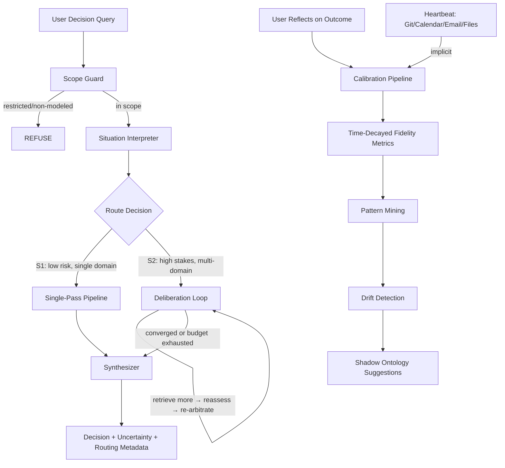

# twin-runtime

**Your AI remembers. But does it judge like you?**

Most AI memory systems optimize recall. twin-runtime optimizes *calibrated judgment*.

twin-runtime is a **calibration-first judgment twin** that learns your decision-making patterns across work domains and provides recommendations that match how you actually choose — while knowing when it should not judge on your behalf at all.

> Memory is input. Calibration is the flywheel. Reliable judgment with clear boundaries is the product.

**Evidence:** 0.758 choice fidelity across 20 real work-domain decisions (alpha).

> **v0.1.0 is an alpha release focused on work-domain calibrated judgment.**
> Best results today: work-domain decisions. Other domains are early/experimental.

---

## Quick Start

```bash
pip install twin-runtime
twin-runtime init
twin-runtime run "Should I prioritize the refactor or the new feature?" \
  -o "Refactor first" "New feature first" "Split the sprint"
```

**Try without setup** (demo mode, no data persisted):

```bash
twin-runtime run --demo "Should I prioritize the refactor or the new feature?" \
  -o "Refactor first" "New feature first"
```

See [docs/quickstart.md](docs/quickstart.md) for detailed installation and setup.

## Claude Code Integration

### Skills

```bash
# Project-level (recommended)
twin-runtime install-skills

# Personal (all projects)
twin-runtime install-skills --personal
```

Then use `/twin-decide`, `/twin-reflect`, `/twin-status`, `/twin-calibrate`, `/twin-dashboard` in Claude Code.

### MCP Server

```bash
claude mcp add --transport stdio twin-runtime -- twin-runtime mcp-serve
```

Or add to `.mcp.json`:

```json
{
  "mcpServers": {
    "twin-runtime": {
      "command": "twin-runtime",
      "args": ["mcp-serve"]
    }
  }
}
```

The MCP server exposes 5 tools:

| Tool | Description |
|------|-------------|
| `twin_decide` | Run calibrated judgment on a decision |
| `twin_reflect` | Record what you actually chose |
| `twin_status` | Show twin state and reliability |
| `twin_calibrate` | Run batch fidelity evaluation |
| `twin_history` | List recent decision traces |

## What Makes This Different

Most memory systems optimize recall. twin-runtime optimizes calibrated judgment.

| Feature | Memory Plugins | twin-runtime |
|---------|---------------|--------------|
| Core loop | Store and retrieve | Decide, reflect, calibrate |
| Output | "Here's what you said before" | "Here's what you'd likely choose, with uncertainty" |
| Feedback | None | Ground-truth outcome tracking |
| Metrics | Recall accuracy | Choice fidelity, calibration quality, abstention correctness |
| Adaptation | Append-only | Bias correction + time decay from real outcomes |
| Boundaries | None | Knows when to refuse — out-of-scope queries get honest abstention |

## Architecture



**Pipeline flow:**
1. **Scope guard** checks restricted use cases and non-modeled capabilities before LLM is called
2. **Situation interpreter** classifies the query into domains with structured LLM output
3. **Route decision** determines depth: S1 (fast, single-pass) or S2 (deliberation with bounded iteration)
4. **S2 deliberation** retrieves more evidence, re-activates heads, re-arbitrates — up to 2 rounds
5. **Synthesizer** produces the final recommendation with honest uncertainty
6. **Reflection loop** records actual choices, feeding time-decayed calibration metrics
7. **Implicit reflection** (heartbeat) infers outcomes from Git activity, calendar, email, and file changes
8. **Pattern mining** detects systematic failure modes across evaluation misses
9. **Drift detection** monitors preference shifts; **shadow ontology** discovers emergent subdomains

## Fidelity Metrics

| Metric | Description | Current Value |
|--------|-------------|---------------|
| **Choice Fidelity (CF)** | % of decisions ranked correctly at #1 | 0.758 (weighted) |
| **Calibration Quality (CQ)** | Match between stated uncertainty and accuracy | 0.807 |
| **Abstention Correctness** | % of out-of-scope queries correctly refused | ≥0.9 (target) |
| **Temporal Stability (TS)** | Consistency over time | experimental |
| **Reasoning Fidelity (RF)** | Similarity of reasoning to user's own | v0.2 |

All metrics support **time-decayed weighting** — recent decisions matter more than old ones.

Generate the fidelity dashboard:

```bash
twin-runtime evaluate
twin-runtime dashboard --output fidelity_report.html --open
```

## CLI Commands

| Command | Description |
|---------|-------------|
| `twin-runtime init` | Initialize twin state |
| `twin-runtime bootstrap` | Interactive onboarding: build a usable twin in 15 minutes |
| `twin-runtime run` | Run a decision through the twin |
| `twin-runtime run --demo` | Try with sample twin (no data persisted) |
| `twin-runtime run --max-rounds N` | Set max S2 deliberation rounds (default 2) |
| `twin-runtime reflect` | Record what you actually chose (`--source`, `--confidence`) |
| `twin-runtime heartbeat` | Implicit reflection from Git/Calendar/Email/file signals |
| `twin-runtime confirm` | Confirm pending implicit reflections (`--list`, `--accept-all`) |
| `twin-runtime mine-patterns` | Detect systematic failure patterns (`--min-failures`, `--lookback`) |
| `twin-runtime status` | Show twin state and fidelity summary |
| `twin-runtime evaluate` | Run batch fidelity evaluation (raw + weighted) |
| `twin-runtime dashboard` | Generate HTML fidelity report |
| `twin-runtime drift-report` | Detect preference and confidence drift |
| `twin-runtime ontology-report` | Generate shadow ontology suggestions |
| `twin-runtime compare` | Run A/B baseline comparison (table/json/html) |
| `twin-runtime install-skills` | Install Claude Code skills |
| `twin-runtime mcp-serve` | Start MCP server (stdio) |

## Development

```bash
git clone https://github.com/ZiyaZhang/twin-runtime.git
cd twin-runtime
pip install -e ".[dev]"
pytest tests/ -q -m "not requires_llm"
```

For shadow ontology features:

```bash
pip install -e ".[dev,analysis]"
```

## License

Apache 2.0. See [LICENSE](LICENSE).
